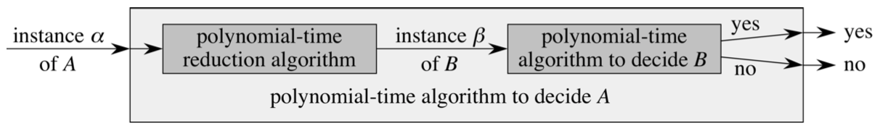

# Complexity Theory

- If a problem can be solved in poly-time, it's an **easy** problem.
- If a problem can be solved in exp-time, it's a **hard** problem.
- **$\boldsymbol{P}$ or Polynomial Time:** Class of problems that can be solved in poly-time on deterministic machines.
- **$\boldsymbol{NP}$ or Non-deterministic Polynomial Time:** Class of decision problems that can be solved in poly-time on non-deterministic machines.
    - Alternative Definition: Class of decision problems for which a solution can be verified by a poly-time algorithm on a deterministic machine.

## Problem Types

- Decision Problems: Are there..? Is it possible to..?
- Counting Problems: How many..?
- Enumeration Problems: List all..that..
- Optimization Problems: What is the best..? What is the max/min..?

Any optimization problem can be cast as a decision problem given a witness solution (i.e. verification) or a quality bound.

## Optimization to Decision Conversion

**Optimization Problem $P$:** Given a function $f$ that maps $x, y \mapsto \boldsymbol{R}$. What is $x$ so that $f(x, y)$ is minimal?

**Decision Problem $P_d$:** Given a function $f$ that maps $x, y \mapsto \boldsymbol{R}$ and a quality bound $d$. Is there $x$ such that $f(x, y) < d$?

If optimization problem $P$ can be solved in $O(T)$, then the decision problem $P_d$ can be solved in $O(T)$ as well since the optimal value is a special case.

If decision problem $P_d$ can be solved in $T$ time, then the optimization problem $P$ can be solved in $O(T \lg N)$, where $N$ is the range of possible values of $P$'s objective function. Divide-and-conquer approach.

## Reductions

A language $L_1$ is polynomial-time reducible to language $L_2$, denoted by $L_1 \leq_P L_2$ if there is a polynomial-time computable function $f : \{0, 1\}^* \rightarrow \{0, 1\}^*$ s.t. $\forall x \in \{0, 1\}^*$ holds:

$$
x \in L_1 \Longleftrightarrow f(x) \in L_2
$$

- The function $f$ is the **reduction function**.
- The poly-time algorithm $F$ to calculate $f$ is a **reduction algorithm**.

### Correctness

A reduction from $A$ to $B$ is correct if:

- Reduction runs in polynomial time.
- The answer to the $A$ instance is "yes" iff it was reduced to "yes" instance of $B$.

### NP-hard & NP-complete

- **NP-hard Problems:** A problem $D$ is NP-hard if every problem in NP is poly-time reducible to $D$.
- **NP-complete Problems:** A problem $D$ is NP-complete if it is in NP and NP-hard.

### Completeness

A language $L$ is **complete** for a language class $C$ with respect to polynomial-time reductions if $L \in C$ and $L' \leq_P L$ for all $L' \in C$.

### Proving NP-Completeness

To prove that $L \in NPC$:

- Prove that $L \in NP$
- Prove NP-hardness
    - Find a known NPC problem, $Q$
    - Show $Q \leq_P L$

## Examples

See Lecture Notes for example derivations of reductions.
