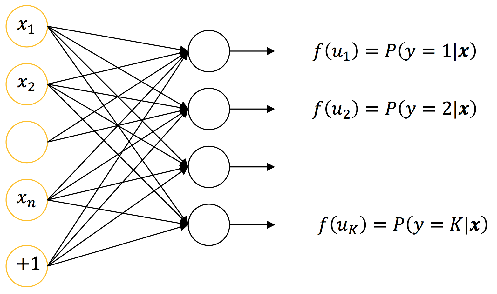

# Neuron Layers

## Softmax Regression

Softmax regression is an extension of logistic regression for multi-class classification problems. It is also known as multinomial logistic regression.

The softmax regression layer consists of a layer of neurons, each corresponding to one class label. The activation $f(u_k)$ of neuron $k$ gives the probability $P(y = k | \boldsymbol{x})$ and the output $y$ gives class label $k$.

$$
y = \underset{k}{\text{argmax }} P(y = k | \boldsymbol{x})
$$

The activation of each neuron $k$ estimates the probability that $\boldsymbol{x}$ belongs to the class $k$ (i.e. softmax activation function):

$$
P(y = k | \boldsymbol{x}) = f(u_k) = \frac{e^{(u_k)}}{\sum_{k = 1}^K e^{(u_k)}}
$$

where $u_k = \boldsymbol{x}^T \boldsymbol{w}_k + b_k$.

### Maximum Synaptic Input

If $u_{\text{max}} = \underset{k}{\text{max }} u_k$ corresponds to the maximum activation, the activation of the neurons can be expressed as:

$$
\begin{split}
P(y = k | \boldsymbol{x})
&= f(u_k - u_{\text{max}}) \\
&= \frac{e^{(u_k - u_{\text{max}})}}{\sum_{k = 1}^K e^{(u_k - u_{\text{max}})}} \\
&= f(u_k)
\end{split}
$$

Then, if neuron $k^* = \text{argmax } u_k$,

$$
f(u_k) = \frac{e^{(u_k - u_{\text{max}})}}{1 + \sum_{k = 1, k \neq k^*}^K e^{(u_k - u_{\text{max}})}}
$$

That is, the activation function is given by a logistic function if the synaptic input is subtracted by the maximum synaptic input:

$$
u_k = u_k - u_{\text{max}}
$$

This can be done for computational stability.

### Synaptic Input to Softmax Layer

Synaptic input to $k$th neuron for input pattern $\boldsymbol{x}_p$:

$$
u_{pk} = {\boldsymbol{x}_p}^T \boldsymbol{w}_k + b_k
$$

Synaptic input to $k$th neuron for batch of $P$ patterns:

$$
\boldsymbol{u}_{k} = \boldsymbol{X} \boldsymbol{w}_k + b_k \boldsymbol{1}_P
$$

The matrix of synaptic input to the layer is given by:

$$
\begin{split}
\boldsymbol{U}
&= \begin{pmatrix} \boldsymbol{u}_1 & \cdots & \boldsymbol{u}_K \end{pmatrix} \\
&= \begin{pmatrix} \boldsymbol{X} \boldsymbol{w}_1 + b_1 \boldsymbol{1}_P & \cdots & \boldsymbol{X} \boldsymbol{w}_K + b_K \boldsymbol{1}_P \end{pmatrix} \\
&= \boldsymbol{X} \begin{pmatrix} \boldsymbol{w}_1 & \cdots & \boldsymbol{w}_K \end{pmatrix} + \boldsymbol{1}_P \begin{pmatrix} b_1 & \cdots & b_K \end{pmatrix} \\
&= \boldsymbol{X} \boldsymbol{W} + \boldsymbol{B}
\end{split}
$$

where $\boldsymbol{W} = \begin{pmatrix} \boldsymbol{w}_1 & \cdots & \boldsymbol{w}_K \end{pmatrix}$ is the weight matrix connected to the layer and:

$$
\boldsymbol{B} =
\begin{pmatrix}
b_1 & b_2 & \cdots & b_K \\
b_1 & b_2 & \cdots & b_K \\
\vdots & \vdots & \vdots & \vdots \\
b_1 & b_2 & \cdots & b_K
\end{pmatrix}
$$

$$
\boldsymbol{U} =
\begin{pmatrix}
u_{11} & u_{12} & \cdots & u_{1K} \\
u_{21} & u_{22} & \cdots & u_{2K} \\
\vdots & \vdots & \vdots & \vdots \\
u_{P1} & u_{P2} & \cdots & u_{PK}
\end{pmatrix}
$$

Rows of $\boldsymbol{U}$ gives the synaptic inputs to the layer, corresponding to each input pattern.

The activation is given by:

$$
\begin{split}
f(\boldsymbol{U})
&=
\begin{pmatrix}
f(u_{11}) & f(u_{12}) & \cdots & f(u_{1K}) \\
f(u_{21}) & f(u_{22}) & \cdots & f(u_{2K}) \\
\vdots & \vdots & \vdots & \vdots \\
f(u_{P1}) & f(u_{P2}) & \cdots & f(u_{PK})
\end{pmatrix} \\
&=
\begin{pmatrix}
P(y_1 = 1 | \boldsymbol{x}_1) & \cdots & P(y_1 = K | \boldsymbol{x}_1) \\
P(y_2 = 1 | \boldsymbol{x}_2) & \cdots & P(y_2 = K | \boldsymbol{x}_2) \\
\vdots & \vdots & \vdots \\
P(y_P = 1 | \boldsymbol{x}_P) & \cdots & P(y_P = K | \boldsymbol{x}_P)
\end{pmatrix}
\end{split}
$$

Thus, the output of the $p$th pattern is:

$$
y_p = \underset{k}{\text{argmax }} \{ P(y_p = k | \boldsymbol{x}_p) \}
$$

And the output of the layer is:

$$
\boldsymbol{y} = \underset{k}{\text{argmax }} \{ P(\boldsymbol{y} = k | \boldsymbol{X}) \}
$$

### GD for Softmax

Given a training dataset $\{ (\boldsymbol{x}_p, d_p) \}_{p = 1}^P$ where $\boldsymbol{x}_p \in \boldsymbol{R}^n$ and $d_p \in \{1, 2, \cdots, K\}$, the cost function for logistic regression is given by the **multiclass cross-entropy** (or negative log-likelihood):

$$
J(\boldsymbol{W}, \boldsymbol{b}) = - \sum_{p = 1}^P \bigg(\sum_{k = 1}^K 1(d_p = k) \log \big( f(u_{pk}) \big) \bigg)
$$

where $1(\cdot)$ is the indicator function $1(\text{True}) = 1$ and $1(\text{False}) = 0$, and $u_{pk}$ is the synaptic input to the neuron $k$ for input $\boldsymbol{x}_p$.

The cost function can also be written as:

$$
J(\boldsymbol{W}, \boldsymbol{b}) = - \sum_{p = 1}^P \log \big( f(u_{p d_p}) \big)
$$

Thus, the partial derivative is derived as follows (complete derivation in Lecture Notes):

$$
\begin{split}
\frac{\partial J(\boldsymbol{W}, \boldsymbol{b})}{\partial \boldsymbol{w}_k}
&= - \sum_{p = 1}^P \bigg(1(d_p = k) - f(u_{pk}) \bigg)
\boldsymbol{x}_p \\
&= - \boldsymbol{X}^T \big( 1(\boldsymbol{d} = k) - f(\boldsymbol{u}_k) \big) \\
&= - \boldsymbol{X}^T \boldsymbol{\delta}_k
\end{split}
$$

where $\boldsymbol{\delta}_k = 1(\boldsymbol{d} = k) - f(\boldsymbol{u}_k)$.

$$
1(\boldsymbol{d} = k) = \begin{pmatrix} 1(d_1 = k) \\ 1(d_2 = k) \\ \vdots \\ 1(d_P = k) \end{pmatrix} \quad
f(\boldsymbol{u}_k) = \begin{pmatrix} f(u_{1k}) \\ f(u_{2k}) \\ \vdots \\ f(u_{Pk}) \end{pmatrix}
$$

Substituting in the GD equation:

$$
\begin{gathered}
\boldsymbol{w}_k = \boldsymbol{w}_k - \alpha \frac{\partial J(\boldsymbol{W}, \boldsymbol{b})}{\partial \boldsymbol{w}_k} \\
\boldsymbol{w}_k = \boldsymbol{w}_k + \alpha_1 \boldsymbol{X}^T \boldsymbol{\delta}_k
\end{gathered}
$$

where $\alpha_1 = \alpha$.

Extending to the weight matrix:

$$
\begin{split}
\boldsymbol{W}
&= \begin{pmatrix} \boldsymbol{w}_1 & \cdots & \boldsymbol{w}_K \end{pmatrix} \\
&= \begin{pmatrix} \boldsymbol{w}_1 + \alpha_1 \boldsymbol{X}^T \boldsymbol{\delta}_1 & \cdots & \boldsymbol{w}_K + \alpha_1 \boldsymbol{X}^T \boldsymbol{\delta}_K \end{pmatrix} \\
&= \begin{pmatrix} \boldsymbol{w}_1 & \cdots & \boldsymbol{w}_K \end{pmatrix} + \alpha_1 \boldsymbol{X}^T \begin{pmatrix} \boldsymbol{\delta}_1 & \cdots & \boldsymbol{\delta}_K \end{pmatrix} \\
&= \boldsymbol{W} + \alpha_1 \boldsymbol{X}^T \Delta
\end{split}
$$

where:

$$
\begin{split}
\Delta
&= \begin{pmatrix} \boldsymbol{\delta}_1 & \cdots & \boldsymbol{\delta}_K \end{pmatrix} \\
&= \begin{pmatrix} 1(\boldsymbol{d} = 1) - f(\boldsymbol{u}_1) & \cdots & 1(\boldsymbol{d} = K) - f(\boldsymbol{u}_K) \end{pmatrix} \\
&= \begin{pmatrix} 1(\boldsymbol{d} = 1) & \cdots & 1(\boldsymbol{d} = K) \end{pmatrix} - \begin{pmatrix} f(\boldsymbol{u}_1) & \cdots & f(\boldsymbol{u}_K) \end{pmatrix} \\
&= \boldsymbol{K} - f(\boldsymbol{U})
\end{split}
$$

Note that $\boldsymbol{K}$ is a binary matrix, where every row corresponds to an input pattern and has 1 corresponding to the class of the pattern.

The gradient descent learning for softmax layer is given by:

$$
\begin{gathered}
\boldsymbol{W} = \boldsymbol{W} + \alpha_1 \boldsymbol{X}^T \Delta \\
\boldsymbol{b}^T = \boldsymbol{b}^T + \alpha_1 {\boldsymbol{1}_P}^T \Delta \\
\boldsymbol{b} = \boldsymbol{b} + \alpha_1 \Delta^T \boldsymbol{1}_P
\end{gathered}
$$

### SGD for Softmax

## Perceptron Layer

To achieve multidimensional functional mapping, a layer of continuous perceptrons is required.

A layer of $K$ perceptrons learns a functional mapping:

$$
\phi: \boldsymbol{R}^n \rightarrow \boldsymbol{R}^K
$$

### GD for Perceptron Layer

Consider a training dataset $\{(\boldsymbol{x}_p, \boldsymbol{d}_p)\}_{p = 1}^P$ where $\boldsymbol{x} \in \boldsymbol{R}^n$ and $\boldsymbol{d}_p \in \boldsymbol{R}^K$.

As a batch:

$$
\boldsymbol{X} = \begin{pmatrix} \boldsymbol{x}_1^T \\ \boldsymbol{x}_2^T \\ \vdots \\ \boldsymbol{x}_P^T \end{pmatrix} \quad
\boldsymbol{D} = \begin{pmatrix} \boldsymbol{d}_1^T \\ \boldsymbol{d}_2^T \\ \vdots \\ \boldsymbol{d}_P^T \end{pmatrix}
$$

Let the weight matrix connected to the layer be $\boldsymbol{W} = \begin{pmatrix} \boldsymbol{w}_1 & \cdots & \boldsymbol{w}_K \end{pmatrix}$ and bias be $\boldsymbol{b} = \begin{pmatrix} b_1 & \cdots & b_K \end{pmatrix}^T$.

Synaptic input $\boldsymbol{U} = \boldsymbol{X} \boldsymbol{W} + \boldsymbol{B}$ and output $\boldsymbol{Y} = f(\boldsymbol{U})$, where activation function $f$ is a sigmoid function and $\boldsymbol{B}$ is the bias matrix with bias vector as rows.

Thus, the mean square error cost function is given as:

$$
J(\boldsymbol{W}, \boldsymbol{b}) = \frac{1}{P} \sum_{p = 1}^P \sum_{k = 1}^K (d_{pk} - y_{pk})^2
$$

The gradient with respect to weight $\boldsymbol{w}_k$ of perceptron $k$ (complete derivation in Lecture Notes):

$$
\begin{split}
\frac{\partial J(\boldsymbol{W}, \boldsymbol{b})}{\partial \boldsymbol{w}_k}
&= - \frac{2}{P} \sum_{p = 1}^P (d_{pk} - y_{pk}) \frac{\partial y_{pk}}{\partial \boldsymbol{w}_k} \\
&= - \frac{2}{P} \sum_{p = 1}^P (d_{pk} - y_{pk}) f'(u_{pk}) \boldsymbol{x}_p \\
&= - \frac{2}{P} \boldsymbol{X}^T (\boldsymbol{d}_k - \boldsymbol{y}_k) \cdot f'(\boldsymbol{u}_k) \\
&= - \frac{2}{P} \boldsymbol{X}^T \boldsymbol{\delta}_k
\end{split}
$$

where $\boldsymbol{\delta}_k = (\boldsymbol{d}_k - \boldsymbol{y}_k) \cdot f'(\boldsymbol{u}_k)$.

Substituting in the GD equation:

$$
\begin{gathered}
\boldsymbol{w}_k = \boldsymbol{w}_k - \alpha \frac{\partial J(\boldsymbol{w}, \boldsymbol{b})}{\partial \boldsymbol{w}_k} \\
\boldsymbol{w}_k = \boldsymbol{w}_k + \alpha_1 \boldsymbol{X}^T \boldsymbol{\delta}_k
\end{gathered}
$$

where $\alpha_1 = \frac{2 \alpha}{P}$.

Extending to a weight matrix:

$$
\boldsymbol{W} = \boldsymbol{W} + \alpha_1 \boldsymbol{X}^T \Delta
$$

where:

$$
\begin{split}
\Delta
&= \begin{pmatrix} \boldsymbol{\delta}_1 & \boldsymbol{\delta}_2 & \cdots & \boldsymbol{\delta}_K \end{pmatrix} \\
&= (\boldsymbol{D} - \boldsymbol{Y}) \cdot f'(\boldsymbol{U})
\end{split}
$$

Thus, the delta learning equations are given as:

$$
\begin{gathered}
\boldsymbol{W} = \boldsymbol{W} + \alpha_1 \boldsymbol{X}^T \Delta \\
\boldsymbol{b} = \boldsymbol{b} + \alpha_1 \Delta^T \boldsymbol{1}_P
\end{gathered}
$$

### SGD for Perceptron Layer

## Initialization of Weights

At initialization, it is desirable that weights:

- are small and near zero to operate in the linear region of the activation function
- preserve the variance of activation and feedback gradients

By considering the above two properties, it has been show that weights should be initialized as follows:

**Logistic Sigmoid:**

$$
w \sim \text{Uniform} \Big[-\frac{4 \sqrt{6}}{\sqrt{n_{in} + n_{out}}}, \frac{4 \sqrt{6}}{\sqrt{n_{in} + n_{out}}} \Big]
$$

**Others:**

$$
w \sim \text{Uniform} \Big[-\frac{\sqrt{6}}{\sqrt{n_{in} + n_{out}}}, \frac{\sqrt{6}}{\sqrt{n_{in} + n_{out}}} \Big]
$$

where $n_{in}$ is the number of input neurons and $n_{out}$ is the number of neurons in the layer (i.e. outputs). $\text{Uniform}$ is a uniformly distributed number within limits.

## Neurons & Layers Summary

## Neuron Layer GD Summary

$$
\begin{gathered}
(\boldsymbol{X}, \boldsymbol{D}) \\
\boldsymbol{U} = \boldsymbol{X} \boldsymbol{W} + \boldsymbol{B} \\
\boldsymbol{W} = \boldsymbol{W} + \alpha_1 \boldsymbol{X}^T \Delta \\
\boldsymbol{b} = \boldsymbol{b} + \alpha_1 \Delta^T \boldsymbol{1}_P
\end{gathered}
$$

