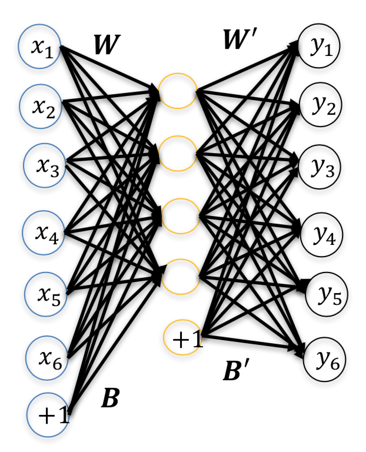

# Autoencoders

An autoencoder is a neural network that is trained to attempt to copy its input to its output. Its hidden layer describes a *code* that represents the input. The network consists of two parts, an encoder and a decoder.

Given an input $\boldsymbol{x}$, the hidden layer performs the encoding function $\boldsymbol{h} = \varphi(\boldsymbol{x})$ and the decoder $\phi$ produces the reconstruction $\boldsymbol{y} = \phi(\boldsymbol{h})$.

If the encoder succeeds,

$$
\boldsymbol{y} = \phi(\varphi(\boldsymbol{x})) = \boldsymbol{x}
$$

Note that autoencoders are designed to be unable to make exact copies and only prioritize the aspects of the input that are learned to be useful by the hidden layer during training.

{height=210px}

$$
\begin{gathered}
\boldsymbol{H} = f(\boldsymbol{X} \boldsymbol{W} + \boldsymbol{B}) \\
\boldsymbol{Y} = f(\boldsymbol{H} \boldsymbol{W}' + \boldsymbol{B}')
\end{gathered}
$$

Reverse mapping may be optionally constrained such that $\boldsymbol{W}' = \boldsymbol{W}^T$.

## Cost Function

The cost function can be measured by many ways, depending on the appropriate distributional assumptions on the input given the code.

If the data is assumed to be continuous and Gaussian distributed, the mean squared error cost is usually used:

$$
J_{\text{mse}}(\boldsymbol{W}, \boldsymbol{b}, \boldsymbol{b}') = \frac{1}{P} \sum_{p = 1}^P || \boldsymbol{y}_p - \boldsymbol{x}_p ||^2
$$

If the inputs are interpreted as bit vectors or vectors of bit probabilities, cross-entropy of the reconstruction can be used:

$$
J_{\text{ce}}(\boldsymbol{W}, \boldsymbol{b}, \boldsymbol{b}') = - \sum_{p = 1}^P (\boldsymbol{x}_p \cdot \log \boldsymbol{y}_p + (1 - \boldsymbol{x}_p) \cdot \log(1 - \boldsymbol{y}_p))
$$

## Denoising Autoencoders

A denoising autoencoder (DAE) receives corrupted data points as inputs and is trained to predict the original uncorrupted data points as its output. In order to achieve this, the DAE's hidden layer discovers more robust features instead of simply learning the identity.

In other words, DAEs attempt to preserve information about the input in order to undo the effect of the corruption process applied to the input.

For training a DAE:

$$
\begin{gathered}
\boldsymbol{X} \rightarrow \widetilde{\boldsymbol{X}} \\
\boldsymbol{Y} \rightarrow \boldsymbol{X}
\end{gathered}
$$

where $\widetilde{\boldsymbol{X}}$ is the corrupted version of data. The corruption process simulates the distribution of data.

### Corrupting Inputs

To obtained corrupted version of input data, each input $x_i$ is added with additive or multiplicative noise.

**Additive Noise (usually used for continuous data):**

$$
\widetilde{x_i} = x_i + \epsilon
$$

where the noise $\epsilon$ is Gaussian distributed (i.e. $\epsilon \sim N(0, \sigma^2)$) and $\sigma$ is the standard deviation that determines the signal to noise ratio.

**Multiplicative Noise (usually used for binary data):**

$$
\widetilde{x_i} = \epsilon x_i
$$

where the noise $\epsilon$ could be binomially distributed (i.e. $\epsilon \sim \text{Binomial}(p)$) and $p$ is the probability of ones and $1 - p$ is the probability of zeroes (i.e. noise).

## Undercomplete Autoencoders

- The hidden layer has a lower dimension than the input in undercomplete autoencoders.
- Learning an undercomplete representation forces the autoencoder to capture the most salient features.
- By limiting the number of hidden neurons, interesting (hidden) structures of input data can be inferred from autoencoders. For example, correlations among input variables, principal components of data etc.
- By learning to approximate $n$-dimensional inputs with $M$ (< $n$) number of hidden units, a lower dimensional representation of the input signals is obtained. The network reconstructs the input signals from the hidden representation.

## Overcomplete Autoencoders

- The hidden layer has a higher dimension than the input of overcomplete autoencoders.
- When the hidden dimensions are large, one could explore interesting structures of inputs by introducing other constraints such as the 'sparsity' of input data.

## Regularizing Autoencoders

Regularized autoencoders provide the ability to train any autoencoder architecture successfully, choosing the code dimension and the capacity of the encoder and decoder based on the complexity of the distribution to be modeled.

Rather than limiting the model capacity by keeping the encoder and decoder shallow and the code size small, regularized autoencoders use a loss function that encourages the model to have other properties besides the ability to copy its input to its output.

Regularized autoencoders add an appropriate penalty function $\Omega$ to the cost function:

$$
J_1(\boldsymbol{W}, \boldsymbol{b}, \boldsymbol{b}') = J(\boldsymbol{W}, \boldsymbol{b}, \boldsymbol{b}') + \beta \Omega(\boldsymbol{H})
$$

A regularized autoencoder can be nonlinear and overcomplete but still learn something useful about the data distribution, even if the model capacity is large enough to learn a trivial identity function.

## Sparse Autoencoders

A sparse autoencoder (SAE) is simply an autoencoder whose training criterion involves the sparsity penalty $\Omega_{\text{sparsity}}$ at the hidden layer:

$$
J_1(\boldsymbol{W}, \boldsymbol{b}, \boldsymbol{b}') = J(\boldsymbol{W}, \boldsymbol{b}, \boldsymbol{b}') + \beta \Omega_{\text{sparsity}}(\boldsymbol{H})
$$

The sparsity penalty term makes the features (weights) learned by the hidden layer to be sparse.

Consider a sigmoid activation function, we say that the neuron is "active" when its output is close to 1 and the neuron is "inactive" when its output is close to 0. With the sparsity constraint, we the neurons at the hidden layer(s) are constrained to be inactive for most of the time.

### Sparsity Constraint

The average activation $\rho_j$ at neuron $j$ of the hidden layer is given by:

$$
\rho_j = \frac{1}{P} \sum_{p = 1}^P h_{pj} = \frac{1}{P} \sum_{p = 1}^P f(\boldsymbol{x}_p^T \boldsymbol{w}_j + b_j)
$$

We would like to enforce the constraint $\rho_j = \rho$ where the sparsity parameter $\rho$ is set to a small value close to zero (say 0.05). That is, the hidden neuron activations are maintained only 5% of the time on average.

### Kullback-Leibler Divergence

To achieve sparse activations at the hidden layer, we introduce Kullback-Leibler (KL) divergence as the sparsity constraint. KL divergence measures the deviation of the distribution of activations at the hidden layer from uniform distribution.

$$
D(\boldsymbol{h}) = \sum_{j = 1}^M \rho \log \frac{\rho}{\rho_j} + (1 - \rho) \log \frac{1 - \rho}{1 - \rho_j}
$$

where $M$ is the number of hidden layer neurons and $\rho$ is the sparsity parameter.

Note that KL divergence is minimum when $\rho = \rho_j$ for all $j$ (i.e. when average activations are uniform and equal to a very low value $\rho$).

The cost function for the sparse autoencoder (SAE) is given by:

$$
J_1(\boldsymbol{W}, \boldsymbol{b}, \boldsymbol{b}') = J(\boldsymbol{W}, \boldsymbol{b}, \boldsymbol{b}') + \beta D(\boldsymbol{H})
$$

For gradient descent (complete derivation in Lecture Notes):

$$
\frac{\partial D(\boldsymbol{H})}{\partial \boldsymbol{w}_j} = \frac{1}{P} \Bigg(\frac{\rho}{\rho_j} + \frac{1 - \rho}{1 - \rho_j} \Bigg) \sum_p f'(u_{pj}) \boldsymbol{x}_p
$$

## Deep Stacked Autoencoders

Deep autoencoders can be built by stacking autoencoders. After training the first level denoising autoencoder, the resulting representation is used to train a second level denoising encoder. This process is repeated and a deep stacked autoencoder is realized.

### Fine-Tuning Deep Network for Classification

After training a stacked autoencoder, an output layer (softmax or linear layer) may be added on the top of the stack for classification. The parameters of the entire system are fine-tuned to minimize the error in predicting the supervised target by supervised gradient descent learning.
